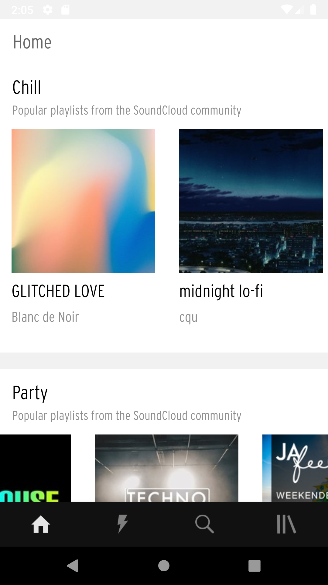
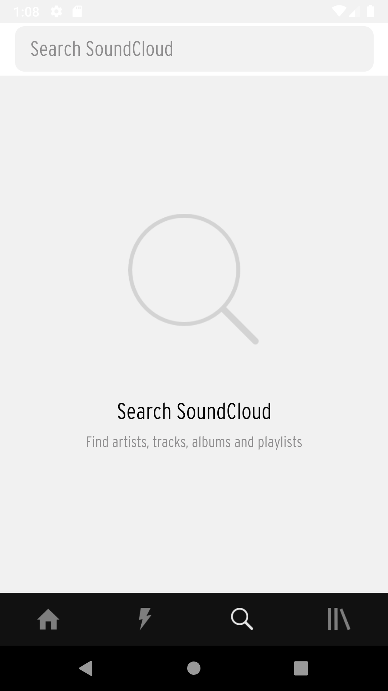
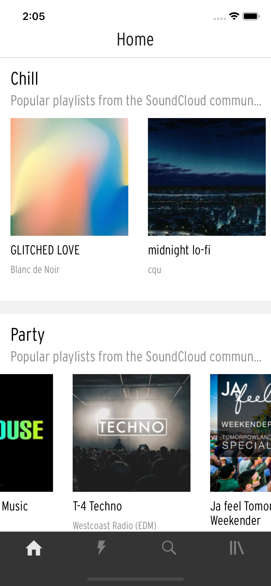
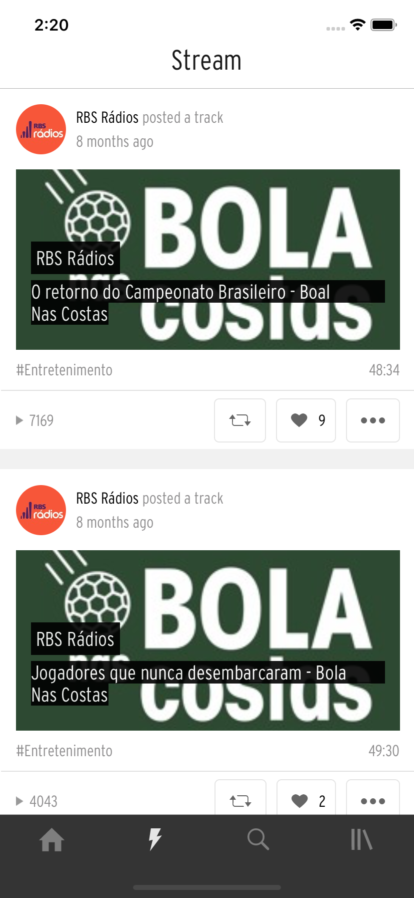
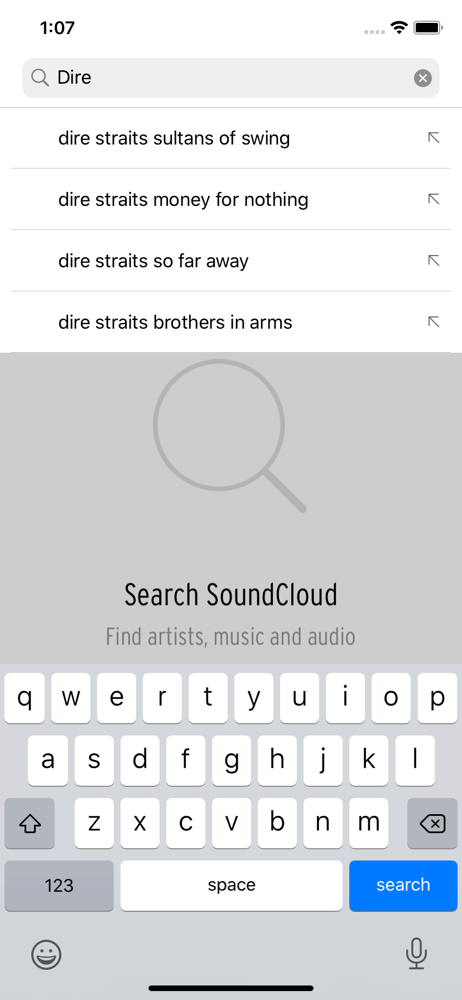

# Xamarin.Forms SoundCloud App Clone

Um clone do SoundCloud feito com Xamarin.Forms. Este app está sendo desenvolvido em live streams que ocorrem semanalmente. Estas lives estão sendo transmitidas pelo [Youtube](https://www.youtube.com/channel/UCD_Cgiqajwi-u-n3lYvp8Ig), [Twitch](https://www.twitch.tv/ionixjunior) e [Periscope](https://www.periscope.tv/ionixjunior).

Para quem prefere Youtube, criei uma [playlist com todas as lives do clone do SoundCloud com Xamarin.Forms](https://www.youtube.com/playlist?list=PL6M6J_6V_um8IzRN4lgRUEWrPWC6iQfiq).

## Screenshots

### Android

#### Tela dos álbuns
<kbd></kbd>

#### Tela dos streamings
<kbd></kbd>

#### Tela de busca
<kbd></kbd><kbd></kbd><kbd></kbd>

### iOS

#### Tela dos álbuns
<kbd></kbd>

#### Tela dos streamings
<kbd></kbd>

#### Tela de busca
<kbd></kbd><kbd></kbd><kbd></kbd>